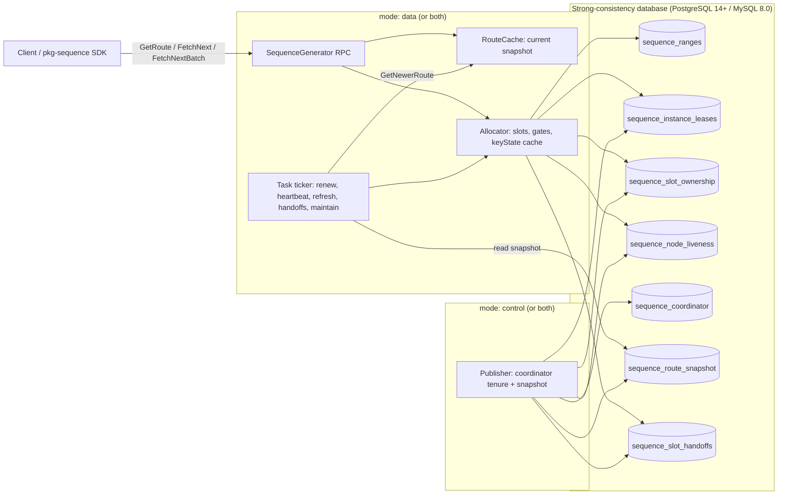
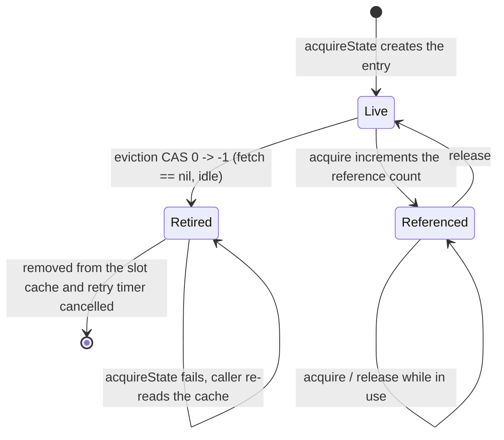
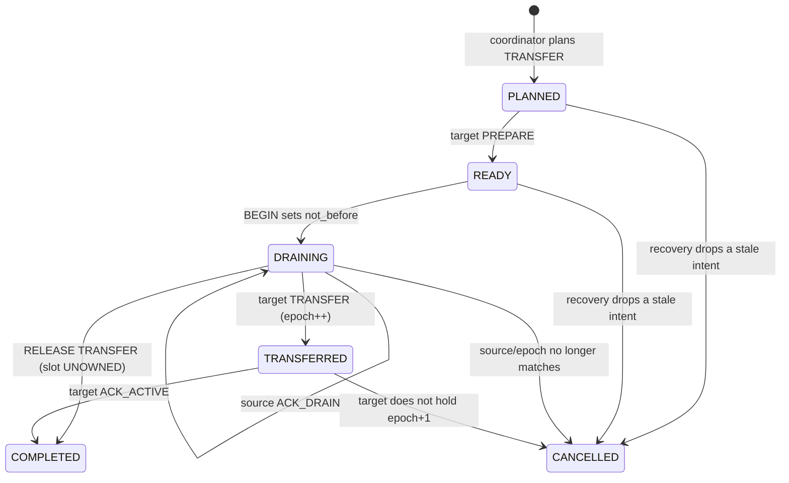
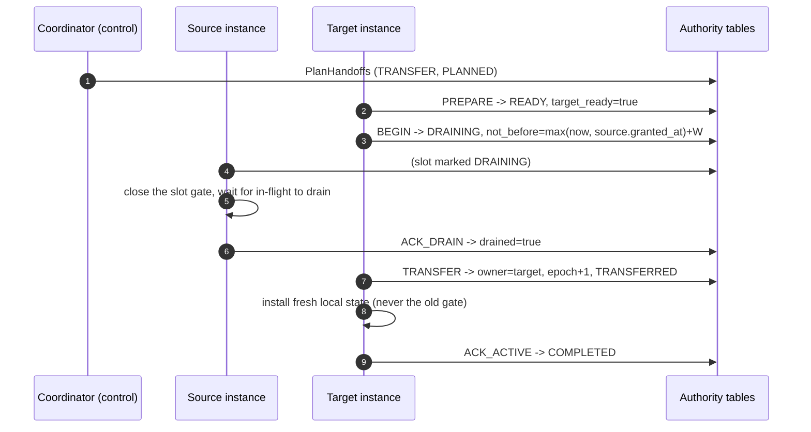
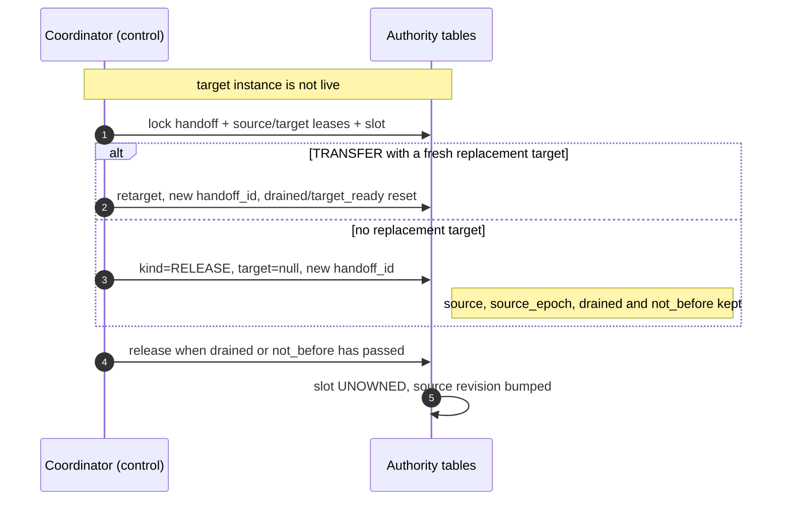

# Sequence high-availability architecture

This is the design record for Sequence. It states what the service guarantees,
the exact storage predicates the guarantees rest on, and the evidence a
deployment is expected to keep. Code comments state the constraint they enforce
next to the code; the section numbers here are a reading aid, not the contract.

Sequence hands out strictly increasing IDs per key. That is the whole
correctness claim: no client may observe an ID that is not greater than every ID
already observed for the same key. Availability, placement, and the published
directory all exist to keep that claim true while processes die, pause, and
restart.

## 1. Safety problem

### 1.1 System model

The key space is hashed into 16,384 slots (`SlotCount`). Each key belongs to
exactly one slot, computed as the IEEE CRC32 of the key modulo `SlotCount`, so a
client that knows the snapshot can compute the same slot the owner does.

A node id names a position in the fleet, such as `sequence-3` in a StatefulSet.
An instance id names one process start of that position. Ownership is fenced on
the pair: `sequence_slot_ownership` names the owner instance, and
`sequence_instance_leases` carries the instance-level revision, node id, and
lease clock that the fence is checked against.

The only durable watermark is `sequence_ranges.reserved_end`, and the service
does not detect it moving backwards. Restoring the Sequence database, or the
volume it lives on, to an earlier point in time can therefore roll the watermark
below IDs the fleet already returned and let a key re-issue them; point-in-time
restore is prohibited. Section 10.5 states the same rule.

One deployable serves every shape. A process starts as `data` (allocator, node
heartbeat, RPC, local placement), `control` (coordinator lease and directory
publication), or `both`.



`SequenceGenerator`, including `GetRoute`, is registered only by a `data` or
`both` process. The `control` process publishes `sequence_route_snapshot`; a
`data` or `both` process refreshes that snapshot into its local `RouteCache` and
serves `GetRoute` from it. A `control` replica is therefore not a client RPC
target.

- The **epoch** is a per-slot generation. It is incremented by every grant and
  never decremented or reused. A release preserves the current epoch and only
  clears the owner, so comparing epochs orders two observations.
- A **local lease** is the interval `L - epsilon` during which an owner serves
  its slots from memory without re-reading storage. The deadline is
  instance-wide: one confirmed instance-lease renewal re-arms every slot the
  instance holds. A slot whose local lease has lapsed refuses allocation until a
  renewal re-confirms the grant.
- The **quiet window** `W` is the interval a non-owner must let pass, measured on
  the storage clock since the owner's instance lease was last granted or
  renewed, before it may take an owned slot over without the owner's
  participation.

The storage is a single strong-consistency database (PostgreSQL 14+ or MySQL
8.0). Every ownership decision -- claim, instance renewal, release, handoff, and
each range reservation -- is one transaction against the authority tables. There
is no consensus protocol between nodes and no leader for allocation: nodes
coordinate only through the rows they share.

### 1.2 The single hazard

The one interleaving the design exists to exclude is a **silent takeover racing
a slow old owner**:

1. Instance A owns slot 7 at epoch 11 and has range `[100, 199]` cached in
   memory. Its local lease is the `L - epsilon` interval in which it may serve
   from that range without a confirmed renewal, and a pause is what can keep it
   from noticing that interval passing.
2. Instance B takes slot 7 over -- legitimately, because the quiet window has
   passed on the storage clock -- and reserves a new range whose IDs overlap the
   ones A still has cached.
3. A resumes and serves the next ID from its cached range. Nothing may let that
   succeed: the key would hand out an ID that is not greater than the one B has
   already granted.

The lease is what stops step 3 locally, and the authority check on every
storage write is what stops it remotely: after step 2, A's instance/epoch pair
no longer matches the row, so a renewal cannot resurrect its authority, and a
reservation under the old epoch is refused by the authority rather than by a
read A would have to trust.

### 1.3 The observable check

Every guarantee is ultimately checked per key: for a fixed key, the sequence of
IDs handed to clients is strictly increasing. Two properties are implied and
are what the tests and the allocation record (appendix F) check:

- no duplicate ID is ever served for a key;
- no ID is served after an ID that is numerically greater for the same key
  (no ordering regression).

A gap is allowed. Unused values from a reserved range become gaps after a
restart, a handoff, or idle eviction; the contract is monotonicity, not
contiguity. State the guarantee precisely, because the weaker readings are
tempting:

- Every pair of **successful** calls for one key returns non-overlapping blocks;
  the higher block is strictly greater than the lower.
- The **delivery order** of concurrent responses is not part of the contract. A
  caller that needs arrival order must order the responses itself, for example
  by the returned `id`.
- `count` requests a **contiguous block**: the response returns `id` and `count`
  such that `[id, id+count)` is reserved for the key. It does not promise that
  the next call continues at `id+count`; the next block may start later.
- A **batch across multiple nodes is not a transaction**. It is grouped by owner
  and issued as independent requests, so one group may succeed while another
  fails.
- A **retry is not exactly-once**. A lost reply or an uncertain commit can
  consume IDs that the caller never sees; retrying the public call can allocate
  again for keys that had already succeeded internally.

### 1.4 Linearisation

Each allocation is a point in the same per-key order. Two allocations for one
key never overlap in that order: whichever granted range covers the lower ID is
linearised first, and the ranges are disjoint. Overlapping *requests* are
allowed -- two callers may fetch for one key at the same time -- and the check
is that their granted blocks do not overlap and their linearisation order
matches the numeric order.

The service does not try to order concurrent requests for latency; it orders
them by making each granted range disjoint. The delivery counters in appendix
F.1 are the evidence that the ordering property held in a deployment's own
traffic.

## 2. Allocation path

### 2.1 The reservation write-skew fence

A range reservation validates ownership and advances `sequence_ranges`
(`sequence_key -> reserved_end`) in one transaction. The naive shape --
read `sequence_slot_ownership`, check it, then write the watermark -- has a write-skew
anomaly: a takeover can commit between the check and the write, so both succeed
and the reservation runs under a superseded epoch.

The fence is the read itself. `lockOwnership` reads the authority rows with a
shared row lock (`SELECT ... FOR SHARE`; MySQL takes the equivalent locking
read inside the transaction). A concurrent claim or release against those rows
must wait for the reservation transaction to commit, so the check and the
watermark advance are serialisable with the ownership change. On SQLite the
transaction lock plays the same role for the component tests.

### 2.2 Slot gates, in-flight allocations, and range reservation

Each slot the instance holds has a gate with an in-flight counter. Allocation
enters the gate first and holds the entry while it reserves a range and serves
IDs from it. The gate is the in-process half of the fence: a drain cannot
complete while an allocation is in flight, and a slot whose local lease has
lapsed cannot be entered at all.

The allocator keeps `slotsMu` (a read/write lock over the slot map) separate
from the gate counters. `FetchNext` and `FetchNextBatch` hold `slotsMu` only long
enough to check the pause state, find the slots, and enter their gates; range
reservation and storage I/O happen after the read lock is released. A
reconcile that needs the write lock therefore never waits behind a blocked
storage statement, which is what removes the periodic tail latency a storage
stall used to cause.

### 2.3 Key state lifecycle

Each slot keeps a cache of per-key state (`keyState`): the active range, the
standby range the prefetcher reserved, the next value to hand out, and a retry
timer. The cache is bounded by idle eviction and by memory admission, so a
request can race the eviction of the very state it is about to use. The race
matters because eviction discards an unused tail of the active range: a request
that prepared a range against a state that a cleanup is simultaneously
retiring could reserve a *new* range while an older pointer still hands out
lower IDs -- an ordering regression.

The protocol that closes it is a per-state atomic reference / retirement gate:

- `keyState.references` is a signed counter. Acquisition CAS-increments it only
  while it is non-negative. Retirement CAS-moves it from `0` to `-1`, which
  permanently closes the entry: acquisition then fails instead of incrementing.
- A request calls `acquireState` first. It holds `slotsMu` (read lock) only for
  the cache lookup and the acquisition, never across range preparation or
  database I/O. Any load failure whose acquisition fails is not used; the caller
  re-reads the cache.
- Every path that holds a reference releases it exactly once on success,
  failure, or cancellation.
- Eviction requires, under the slot write lock and the state lock, that the
  state has no in-flight prefetch (`fetch == nil`) and that
  `references.CompareAndSwap(0, -1)` succeeds. Only then does it mark the state
  retired, cancel the retry timer, account for the discarded IDs, and remove it
  from the slot. A state with a live reference, an in-flight fetch, or a
  recently used timestamp is left in place.
- Prefetch keeps its existing guard: a scheduled retry checks `retired` before
  arming, and `cancelRetry` retires the state so a timer that already fired
  cannot resurrect it.

Single-key (`FetchNext`), contiguous (`FetchNextN`), and batch
(`FetchNextBatch`) requests all use the same protocol. The loop is:



Cleanup scans a bounded slice of slots per pass (`cleanup_slots_per_run`) so a
hot slot cannot stop cold keys in other slots from being evicted, and the
write lock is held only for the per-candidate retirement decision.

## 3. Time model

### 3.1 Reading the storage clock

Every bound is expressed in storage time, and the storage evaluates the
comparison: the owner's instance-lease `granted_at` is written by the storage
clock, and the quiet-window test is `owner.granted_at <= now - W` with `now` read
from the same clock inside the same transaction. A node's own clock never
decides who may take a slot over.
`StorageClock` on the ownership repository and
`sequence.ha.clock_drift_seconds` /
`sequence.ha.storage_clock_forward_jump_seconds` are how a deployment observes
the property (appendix E).

Clock observations bracket each database sample with local monotonic readings.
The monitor compares the possible elapsed-time intervals and fences only when
every possible drift exceeds the asserted bound. Network or scheduling jitter
that leaves the comparison ambiguous increments
`sequence.ha.clock_uncertain_samples` instead of fencing; sampling RTT is exposed
as `sequence.ha.clock_sample_rtt_seconds`. Sampling is anomaly detection, not a
replacement for the platform's clock and pause guarantees.

Optional allocation recording keeps both its observation ring and its per-key
LRU at 4,096 entries by default. Key eviction increments
`sequence.ha.recording_evicted_keys` and forgets that key's comparison baseline,
but never resets cumulative counters. This is bounded, process-local evidence,
not an unlimited-history or cross-node ordering audit.

### 3.2 Bounds

| Symbol | Configuration | Meaning |
| --- | --- | --- |
| `L` | `lease_duration` | local lease length: how long an owner may serve a slot from memory after the last confirmed grant |
| `W` | `quiet_window` | silent-takeover window, judged by the storage clock |
| `P_max` | `max_pause` | assumed hard bound on a process pause |
| `delta` | `clock_drift` | assumed local-versus-storage drift |
| `J_max` | `clock_jump` | bound on a forward jump of the storage clock |
| `epsilon` | `safety_margin` | extra margin kept inside `L` and required in `W` |

The local deadline actually armed on a slot is `L - epsilon`
(`LeaseDeadline`). It is derived rather than configured so a renewal is always
attempted while the storage grant is still valid.

The deadline is anchored to a monotonic reading taken **before** sending the
claim or renewal. Time spent waiting for storage consumes that interval rather
than extending it. Each claim batch retains its own anchor; a grant already
expired when it arrives is never installed as serving authority. Claims retain
confirmed progress across bounded passes, and the directory-version barrier
advances only after the current plan finishes. A new epoch installs fresh local
state and never inherits the previous epoch's cached ranges.

Every cursor advance and standby activation checks the local slot before and
after the in-memory operation. Storage, lock and prefetch waits precede those
checks. A rejected operation may consume IDs but returns no allocation, and
foreground reservations have their own `reserve_timeout` within the caller's
deadline. Every reservation, including a merged batch, presents the instance
revision, each slot's epoch, and the storage lease.

### 3.3 Quiet window lower bound

`W` must satisfy

```
W >= L + delta + P_max + J_max + epsilon
```

and `HAConfig.Validate` refuses to start otherwise. The proof obligation is
that a candidate may not claim a slot over until every ID the old owner may
still legitimately hand out is behind it:

1. The old owner's last confirmed grant started its storage lease. From that
   instant it may serve from memory for at most `L` without a new confirmation.
2. Its view of elapsed time may differ from the storage's by at most `delta`, so
   the candidate must allow `delta` of skew.
3. It may be paused, so it may not observe the passage of its own lease for up
   to `P_max`; the pause is what makes the hazard silent rather than visible.
4. The storage clock itself may jump forward while the owner is unaware, so
   `J_max` of storage time may pass without the owner's local lease advancing.
5. `epsilon` keeps the boundary strictly inside the safe side rather than at
   equality.

The storage enforces the bound in the claim predicate: the claim only grants
when the owner instance lease's `granted_at` is at least `W` old, and the grant
increments the epoch, so any reservation the old owner attempts afterwards
fails its epoch check.

### 3.4 Pause self-check and the local deadline

The bound above assumes `P_max`. A deployment cannot derive `P_max` from
configuration or from the database; it must be measured on the platform and
asserted with `pause_verified` (section 10.2). At runtime the allocator
measures the in-memory linearisation interval on its fast path and discards an
allocation that exceeded the asserted bound, rather than serving an ID whose
ordering the pause may have broken
(`sequence.ha.pause_violations`, `sequence.ha.pause_seconds`).

The local deadline and the pause check are two halves of one rule: the deadline
stops serving after `L - epsilon` without a confirmed renewal, and the pause
check stops serving an allocation that crossed `P_max` inside the in-memory
section. A pause can therefore only make an owner serve less, never more.

## 4. Serving, leases, and recovery

A slot's local lifecycle is:

1. **Planned.** The node's heartbeat computes the desired set from
   `sequence_slot_ownership` and `sequence_node_liveness` (section 10.4,
   appendix C).
2. **Claimed.** The node asks the authority for the slots it was assigned.
   Granted slots install an epoch and arm a local deadline of `L - epsilon`.
3. **Serving.** Requests enter the slot gate while the deadline is in the
   future. One instance-lease renewal keeps the shared deadline moving.
4. **Fenced.** A renewal that is refused, or a local deadline that passes
   before a renewal confirms the grant, closes every gate. The slot refuses
   allocation with `SEQUENCE_OWNER_RECOVERING` / `SEQUENCE_LEASE_EXPIRED`
   until a renewal succeeds.
5. **Released.** On graceful shutdown the instance retires its lease and hands
   each held slot back through the handoff path (section 5.2, 6.3, 6.5).

Renewal runs on its own loop at `ha.renew_interval`, not on the node heartbeat
and not on a logical tick, because it is a wall-clock obligation: pacing it by a
configurable logical tick would make the safety window depend on the tick
interval. It is also one storage statement for the whole instance -- it updates
a single `sequence_instance_leases` row -- so the cost does not grow with the
number of slots the instance holds, and the deadline it re-arms is shared by all
of them. `sequence.dataplane.renewal_batch_duration_seconds` and
`sequence.dataplane.renewal_batch_size` observe that one round trip; the size
histogram records the one instance row, not the owned slot count.

## 5. Membership and handoff

### 5.1 Node ids, instances, and fencing identity

`sequence_node_liveness` records `(node_id) -> instance_id, last_seen_at`, with
`last_seen_at` written by the storage clock. `node_ttl` is how long a row counts
as current. A graceful shutdown deletes its own row, so a rolling update does
not wait out a full TTL; a crash leaves exactly one stale row, and the table
stays bounded by the fleet size.

The node id is a fleet position and the instance id is the process that last
registered it. That split is what makes two cases different:

- the same instance still live: the slot stays with it while its lease is
  fresh;
- a new instance on the same node id (a restart): the old instance's slots
  rejoin the even split, and the new process reclaims its share once its claim
  clears the quiet window -- the old process's lease is the interval the window
  covers.

### 5.2 Planned handoff and crash takeover

Moving a slot off an instance is a **handoff**: a durable intent in
`sequence_slot_handoffs` that both parties execute through the coordinator,
rather than a release done by the leaving instance alone. A handoff has a
`kind`:

- **TRANSFER** names a `target_instance_id`. The target prepares, the source
  drains, and the target claims at a fresh epoch.
- **RELEASE** has no target. It is how a graceful shutdown returns a slot to the
  unowned pool, and it is also what an orphaned TRANSFER degrades to.

The phase is one of `PLANNED`, `READY`, `DRAINING`, `TRANSFERRED`, `COMPLETED`,
or `CANCELLED`; `drained`, `target_ready`, and `not_before` are the per-phase
fences.



The normal TRANSFER sequence is:



`not_before` is the quiet window measured from the later of the storage clock
and the source's last confirmed grant. It is what lets a target finish a
transfer even when the source never acknowledges: once `not_before` passes, the
source can no longer legitimately serve the slot, so the target may take it.
`ACK_DRAIN` lets the source shorten the wait honestly by confirming that its
in-flight work reached zero.

Graceful shutdown is a RELEASE: the leaving instance issues `WITHDRAW`, which
creates a `READY`/RELEASE handoff for a slot it still owns, then drains and
finalizes it with `TRANSFER` once `drained` or `not_before` holds. The slot
becomes `UNOWNED`, and the next claim takes it immediately without waiting for a
window.

When a target dies before a transfer completes, the coordinator repairs the
intent on its next pass (`RecoverHandoffs`), under the coordinator tenure and
the instance, slot, and handoff locks:



Degrading to RELEASE is the fix for the single-node case: with no other live
instance there is nobody to receive a TRANSFER, so the intent must be allowed to
resolve to "unowned" and be re-claimed by the same instance at a **new epoch**.
The source's `source_instance_id`, `source_epoch`, its drain acknowledgement,
and its `not_before` are preserved, so the old target's commands (keyed by the
old `handoff_id`) are rejected and the release still honors the original drain
fence. Only after the drain is confirmed or `not_before` passes does the
existing release/claim path re-grant the slot; the old gate is never reopened,
and the new grant installs fresh local state.

A crash needs no coordinator repair for ownership itself: the instance lease row
ages, the remaining nodes plan the slots away once the owner is not live, and
their claims wait out `W` inside the authority. Recovery RTO for a crashed node
is therefore bounded by `node_ttl` (to notice) plus `W` (to take over), plus a
heartbeat. The coordinator repair path above only has to run when a handoff was
in flight and its target vanished.

There is still no operator-driven drain RPC: the ways to move authority are a
graceful shutdown (a RELEASE handoff) or letting the lease lapse.

## 6. Ownership protocol

### 6.1 Reservation lease fence

Every range reservation carries `ReservationAuthority{InstanceID, Revision,
Epochs, Lease}`. The storage transaction locks the instance row and the slot
rows (section 2.1) and checks them:

- the instance row is `ACTIVE`, names the caller, and its `ownership_revision`
  equals the caller's;
- `state = OWNED` and `owner_instance_id` equals the caller's instance;
- `epoch` equals the caller's epoch recorded for that slot;
- the caller's instance lease has not passed: `granted_at + Lease` is after the
  storage clock.

A reservation that fails is refused with `SEQUENCE_OWNER_RECOVERING` (stale
instance revision), `SEQUENCE_SLOT_NOT_OWNER`, or `SEQUENCE_LEASE_EXPIRED`; the
watermark is not advanced. `commit_uncertain` outcomes discard the range rather
than re-reading the watermark, because a gap is safe and a duplicate is not.

### 6.2 Claim

`ClaimSlots` grants each requested slot when it is unowned, when the caller
already holds it, or when the current grant has aged past the quiet window. Each
grant increments the epoch and records the new owner instance in one statement
(PostgreSQL uses `UPDATE ... RETURNING`; MySQL and SQLite lock the rows and
update inside a transaction). A grant has no per-slot timestamp: its age is the
`granted_at` of the owner's `sequence_instance_leases` row, which registration
and renewal write from the storage clock (section 6.6). A refusal reports
`NotBefore = granted_at + W` for the current owner, so a candidate knows when to
retry instead of polling blind.

### 6.3 Drain-and-release order

Releasing a slot is the one operation where ordering is safety-critical:

1. the slot leaves the active set and its gate closes to new allocations;
2. the drain waits, up to `release_drain_timeout`, for the in-flight counter to
   reach zero;
3. only then is the RELEASE handoff issued; its epoch-and-drain guard is what
   makes the handover safe (section 6.5).

A slot whose drain times out is **not** released. Releasing it would let a new
owner start while this instance could still serve an ID from its cached range,
which is exactly the regression the protocol exists to prevent. The slot keeps
its authority and is left to the quiet window instead.

### 6.4 Quiet-window claim rule

The authority grants an owned slot to a different instance only when the owner
instance lease has aged past the window:

```
owner.granted_at <= <storage now> - W
```

where `granted_at` is the owner's `sequence_instance_leases.granted_at` (section
6.2), and the comparison is evaluated inside the same statement (PostgreSQL) or
transaction (MySQL/SQLite) that increments the epoch. The read a candidate makes
for its own planning uses `OwnershipSegments`, which joins the same instance
lease row and classifies a run as quiet-window overdue with the same storage
clock, so the plan and the claim agree about which slots are takeable.

A `DRAINING` slot is the exception: its RELEASE handoff resolves it without a
fresh quiet-window judgement -- the next claim takes it as soon as the
handoff's own fence allows, once the source has drained or its `not_before`
has passed (section 6.5). The window covers the owner that stops
participating; a drained release is the owner participating.

### 6.5 Release

Release is expressed as a RELEASE handoff (section 5.2) rather than a bare slot
update, so the drain fence and the command identity are durable. The slot moves
to `UNOWNED` only when the source still owns it at the handoff's `source_epoch`
and the handoff's `drained` flag is set or `not_before` has passed; the epoch is
preserved, so a released generation can never be handed out again, and a stale
release cannot revoke a newer owner. An exact-match release takes effect
immediately: the next claim sees an unowned slot and does not wait for the
window. A release whose predicates do not match changes nothing.

On startup and shutdown the instance is fenced by its lease row, not by an
enumeration of slots. `RegisterInstance` inserts the row or refuses when an
`ACTIVE` row already names a different node for the same instance id;
`RetireInstance` flips the row to `RETIRED` and bumps the revision, which fences
any in-flight statement the old process might still be running.

### 6.6 Instance lease renewal

Renewal refreshes the single `sequence_instance_leases` row for the instance
under the CAS `instance_id + state=ACTIVE + ownership_revision`. It is
deliberately **not** lease-checked: a lease may expire early but never late, so
a renewal that cannot be confirmed must not extend a local deadline; leaving
the deadline alone is the safe direction.

Because the row is per instance, one statement re-arms every slot the instance
holds, whatever the count, and the shared local deadline moves with it. Slots
are not renewed individually and no per-slot grant timestamp is refreshed; a
slot's authority is derived from the instance lease (including its `granted_at`)
plus its own `epoch` and `state`.
A renewal whose revision no longer matches is refused, the instance resyncs its
authority, and a resync that cannot confirm the lease fences every gate rather
than re-arming it. A drained or fenced instance stops renewing altogether --
that is what lets its slots age past the window and be taken over.

## 7. The published directory

### 7.1 Snapshot shape

`sequence_route_snapshot` holds exactly one row (`id = 1`): the newest published
revision and its encoded payload. A payload carries exactly two fields:

- `layout_version`, the slot layout the snapshot was minted under;
- `segments`: ordered, gap-free runs of slots sharing owner node, owner
  instance, and epoch, including unowned runs.

The publisher encodes the compact authority read directly. Only a change of
owner story starts a stored segment: the quiet-window classification that split
the read into finer runs is canonicalised away, so a grant ageing across the
window does not mint a revision for a directory that means the same thing.
Unowned runs are written without an owner or epoch, so a reader pauses them
rather than routing them to the empty node. Because the snapshot is a single
row that is replaced in place, there is no revision history to prune and no
retention setting.

### 7.2 Client compilation

A client refuses a snapshot that does not cover every slot exactly once.
`segments` are required and are the authoritative owner source: they must cover
all 16,384 slots exactly once and carry a per-slot epoch for every owned slot; a
snapshot with no segments, or with a gap or overlap, is refused as an invalid
route.

There is no pre-authority snapshot shape and no legacy compilation path: the
candidate baseline is an empty database, so every snapshot a current server
publishes carries segments and every caller sends an epoch.

### 7.3 Version handoff

The service compares the caller's `routerVersion` with the version of the
directory this node serves; the check never blocks, and the tests pin that it
returns immediately. One rule applies:

- `rv < route.Version()`: the caller is behind the published directory and gets
  `SEQUENCE_ROUTE_EXPIRED` with `retryable=refresh`;
- `rv == route.Version()`: the comparison passes; if this node has not applied a
  directory to its allocator yet, the allocation is refused with
  `SEQUENCE_ALLOCATOR_PAUSED` (retry) until it has, rather than being treated as
  stale;
- `rv > route.Version()`: the caller knows a newer directory than this node; the
  node refuses with `SEQUENCE_OWNER_RECOVERING` (retry) rather than answering
  from a directory the caller has already moved past, and the caller's retry
  budget bounds the wait.

A batch is grouped by owner only. Every key must land on the same owner, but the
keys may be at different epochs: the anchor slot's epoch is a routing hint the
server checks from the caller's view, and each key is fenced independently by
the gate of its own slot.

## 8. Configuration

### 8.1 Parameters and hard bounds

Data plane, `app.sequence.dataplane.ha`:

| Parameter | Default | Constraint |
| --- | --- | --- |
| `lease_duration` | `3s` | positive; local lease `L` |
| `quiet_window` | `5s` | `>= L + clock_drift + max_pause + clock_jump + safety_margin` |
| `max_pause` | `1s` | positive; must be measured, not guessed |
| `clock_drift` | `100ms` | not negative |
| `clock_jump` | `100ms` | not negative |
| `safety_margin` | `500ms` | positive; also defines `L - epsilon` |
| `renew_interval` | `1s` | within `(0, L)` |
| `release_drain_timeout` | `2s` | positive |
| `node_ttl` | `15s` | positive; must exceed the heartbeat period by a wide margin |
| `pause_verified` | off | must be asserted |
| `clock_disciplined` | off | must be asserted |
| `linearization_recording` | off | turns on the appendix F.2 record |

Cross-section rule: `lease_duration - safety_margin` must exceed
`renew_interval + allocator.reserve_timeout`, so a renewal can always complete
before the deadline it has to beat.

Node identity and cadence, `app.sequence.dataplane.node`:

| Parameter | Default | Constraint |
| --- | --- | --- |
| `id` | required | the node's fleet position; also its liveness identity |
| `heartbeat_interval` | `1s` | positive; renews the liveness row |
| `route_refresh_interval` | `1s` | positive; refreshes the local directory |
| `handoff_interval` | `250ms` | positive; drives the handoff pass |
| `route_query_timeout` | `1s` | positive; bounds one route read |

Control plane, `app.sequence.controlplane`:

| Parameter | Default | Constraint |
| --- | --- | --- |
| `layout_version` | `1` | positive |
| `active_publish_interval` | `250ms` | within `(0, reconcile_interval]` |
| `coordinator_lease` | `10s` | positive |
| `reconcile_interval` | `5s` | positive; below the coordinator lease |
| `pass_timeout` | `3s` | positive; below the coordinator lease |
| `migration.join_stability_window` | `15s` | positive; a joiner must be live this long before rebalancing |
| `migration.batch_slots` | `64` | positive; <= 1000 and <= each of the inflight/source/target caps |
| `migration.max_inflight` | `256` | positive |
| `migration.max_per_source` | `64` | positive |
| `migration.max_per_target` | `64` | positive |
| `migration.max_planned` | `1024` | `>= max_inflight`, `<= SlotCount` |

Validation is scoped by mode. Every mode validates the shared authority bounds
(lease, quiet window, clock/pause bounds, `node_ttl`) plus the database identity
and the runtime memory setting. Allocator sizing, node cadence, renewal
interval, release drain timeout, and the cross-section deadline rule are
validated only in `data` and `both`, because a `control` replica starts none of
those components and must not be forced to carry their settings.

### 8.2 Assumptions

The target envelope is at most 100 live nodes, 16,384 slots, a roughly 1s
heartbeat, and a `node_ttl` of about 15s. Placement and publication are
designed to stay proportional to the number of live nodes in that envelope, not
to the slot count (section 10.3).

## 9. Failure matrix

| Failure | Authority effect | Client effect | Recovery |
| --- | --- | --- | --- |
| Data node crashes | its rows keep naming the dead instance; grants age | keys on its slots refuse once leases lapse | remaining nodes plan the slots away; claims wait out `W`; RTO ~ `node_ttl + W` |
| Data node is paused beyond `P_max` | in-memory allocations that crossed the bound are discarded; the lease lapses if the pause exceeds `L` | `SEQUENCE_OWNER_RECOVERING` then `SEQUENCE_LEASE_EXPIRED` | a renewal before the deadline re-arms the slot; after it, the fleet takes over |
| Node restarts under the same node id | the new instance reclaims its share at the next epoch | a short refusal during the claim | the restart reclaims its share; the old instance's lease is the wait |
| Storage unreachable | claims, renewals, reservations fail | retriable reasons (`storage_unavailable`, `commit_uncertain`), never a duplicate | the node keeps serving only within its local leases; renewals re-arm when storage returns |
| Network partition between nodes | nothing: nodes never talk to each other | none beyond the storage partition itself | placement is recomputed from shared rows |
| Publisher dies | the coordinator row expires; publication stops | already-published directory keeps being served | any control replica takes the same row and republishes |
| Publisher partition (stale tenure) | `GuardCoordinator` fails the write | none; no revision is published | the replica that holds the current tenure republishes |
| Ownership view short or overlapping | the reader refuses it | none; the previous desired set and directory stay in force | the next read retries |
| Handoff target crashes before `TRANSFERRED` | the `PLANNED`/`READY` intent is left pointing at a dead instance | keys on the slot keep serving from the source | the coordinator cancels it, or retargets a fresh replacement |
| Handoff target crashes with no replacement target | a `TRANSFER` can never complete | the source keeps serving under its original drain fence | recovery turns it into a `RELEASE` (new `handoff_id`); the source re-claims at a new epoch |
| Handoff target crashes after `TRANSFERRED` | the slot names an instance that never reached `ACK_ACTIVE` | keys route to the dead target and refuse | the slot is replanned; once the dead target's lease ages out another node claims the slot, and that successful claim cancels the stale intent |
| Duplicate recovery pass | repeated `RecoverHandoffs` under the coordinator tenure | none | every transition is guarded by the handoff `id`, phase, and slot epoch, so it is idempotent |
| `sequence_slot_handoffs` growth | active intents are bounded by `migration.max_planned`; completed/cancelled rows are overwritten by slot | none | planning is admitted only under `max_planned`, so a burst cannot outrun the budget |

Any failure that could produce a duplicate ID is treated as a safety event, not
an availability event: the affected slot is fenced and refuses work.

## 10. Operations

### 10.1 Startup, readiness, and shutdown

A process starts in `data`, `control`, or `both` mode. A data process is
unready until it has loaded a directory and applied it to its allocator; a
control process reports `stalled` when no publish pass has completed for three
pass intervals and stays ready while passes fail, with `last_pass_failed`
distinguishing the two. The readiness body reports the bounds in force
(`quiet_window_seconds`, `lease_duration_seconds`, `max_pause_seconds`) so a
probe failure can be read against the safety argument.

Shutdown is ordered: the process pauses admission, stops renewing its instance
lease and liveness row, drains the slots it holds, and hands them back as
RELEASE handoffs; the remaining nodes converge. The graceful-release budget
(`release_drain_timeout + allocator.reserve_timeout`) is shared across the
release batches, so a drain that times out, a failed release, or an expired
budget leaves the remaining slots held rather than released early; because the
instance stops renewing, those slots then age out through the quiet window and
are taken over naturally. That is slower for the successor but never
incorrect. The authority rows are the record; publication is driven by
`reconcile_interval` reading them, and no separate event mirror exists.

### 10.2 The measured-pause requirement

`P_max` covers the one hazard no database can observe: a process that was
paused while its lease elapsed. It cannot be derived from configuration or from
storage, so the service refuses to start unless `pause_verified` is set. The
same is true of `J_max`, asserted with `clock_disciplined`: no database bounds a
forward jump of its own clock, so a deployment must either discipline and
monitor the storage clock or use a storage whose transactions carry a monotonic
commit timestamp. Both requirements are asserted by the shared authority
validation and are the basis of the quiet-window floor.

### 10.3 Capacity envelope

At 100 live nodes the control plane must not read per-slot rows:

- `OwnershipSegments` aggregates the space into runs of shared owner story, so
  a steady fleet returns O(number of live nodes) runs rather than 16,384 rows.
  The planner and publisher read that view; the per-slot `OwnershipView` stays
  for diagnostics, tests, and reservation checks only.
- Renewal is one statement for the `sequence_instance_leases` row rather than
  one per slot (section 6.6); `sequence.dataplane.renewal_batch_duration_seconds`
  and `sequence.dataplane.renewal_batch_size` observe that single round trip.
- Publication replaces the single `sequence_route_snapshot` row in place, so
  there is no revision history to prune and no retention setting to bound.

`BenchmarkOwnershipSegmentsAtHundredNodeSteadyState` pins the read's shape: a
100-node fleet holding the space in even shares reads back as one run per node
(plus the unowned remainder), and the returned-run count is reported as a
benchmark metric so a regression to per-slot rows is visible as `segments/op`.

All ownership and placement reads are served by the primary, never a replica:
replication lag would make a grant look younger than it is, and the quiet
window is a lease decision.

### 10.4 Placement, liveness, and publisher fencing

Placement is computed locally by every node from `sequence_slot_ownership` plus
`sequence_node_liveness`; there is no central placement table and no central
planner, and the only durable movement intents are the handoffs (section 5.2).
Appendix C lists the rules. A node claims only what its own plan assigned it, so
the authority store -- not the plan -- decides the outcome.

Publication is serialised by `sequence_coordinator` (one row, `id = 1`). A pass
acquires the lease, planning may take a while, and the write then re-presents
the tenure: `GuardCoordinator` updates and verifies
`owner_instance_id = ? AND epoch = ? AND expires_at >= now` inside the publish
transaction. A tenure that is no longer in force fails with
`ErrCoordinatorLost`, and the pass is abandoned -- the new coordinator
republishes the current view. The epoch is the fencing token: a stale writer
cannot publish even if it never observed the takeover.

The directory the publisher writes is the authority view itself. The publisher
never invents placement, never reads liveness, and never preempts a slot. That
is what keeps a control-plane outage from affecting what a data node may serve.

### 10.5 Schema and migrations

Each dialect owns its migrations under `migrations/sequence/{postgres,mysql}`.
The candidate baseline is a single `init` migration per dialect rather than a
chain of upgrades, because it is applied to an **empty** database. The schema
consists of:

- `sequence_slot_ownership` with one row per slot (the authority), seeded
  `UNOWNED` by the migration;
- `sequence_instance_leases` keyed by instance id (revision, node id, lease
  clock, state);
- `sequence_node_liveness` keyed by node id (fleet membership);
- `sequence_coordinator` with its single elected row;
- `sequence_route_snapshot` with the single published revision;
- `sequence_slot_handoffs` keyed by slot id (the durable migration intents);
- `sequence_ranges` keyed by `sequence_key` for watermarks.

The baseline does **not** upgrade a previously populated schema and does not
add a migration bridge from one: rebuild into an empty database instead. Both
directions are exercised by the integration suite (appendix D).

One restore rule is absolute: never restore the Sequence database, or the
volume it lives on, to an earlier point in time. The service does not detect
`sequence_ranges.reserved_end` moving backwards, so a point-in-time restore can
roll the watermark below IDs the fleet already returned and let a key re-issue
them.

### 10.6 Observability

The process exports low-cardinality metrics only; no metric carries a key or a
slot id. The HA gauges are the bounds in force, and the counters are the
outcomes of the protocol, so a dashboard can read the safety argument and the
failure modes together (appendix E).

### 10.7 Deployment parameters, metrics, and publisher fencing

For a deployment:

- set the bounds in `app.sequence.dataplane.ha` and the publisher cadence and
  migration limits in `app.sequence.controlplane` (section 8.1);
- assert `pause_verified` from a measured platform pause bound and
  `clock_disciplined` from a disciplined, monitored storage clock;
- keep `node_ttl` well above the heartbeat period, and keep
  `release_drain_timeout` above the longest legal in-flight allocation;
- run the publisher in at least two control replicas so the coordinator lease
  can move;
- alert on `sequence.control.unowned_slots` staying above zero,
  `sequence.ha.lease_expired`, `sequence.ha.pause_violations`,
  `sequence.ha.gate_fenced`, and `sequence.ha.clock_drift_seconds` leaving its
  asserted bound.

The publisher's writes are fenced by the coordinator epoch (section 10.4) and
the route payload is validated before it is written. `GetRoute` serves the
current snapshot; there is no older revision to roll back to, so a rollback
re-publishes from the authority rather than restoring a prior row.

## Appendix A: Caller protocol

### A.1 Methods

- `FetchNext(key, count)`: allocate a contiguous block for one key.
- `FetchNextBatch(requests)`: allocate for many keys that share one owner.
- `GetRoute(knownVersion)`: fetch the directory, or `not_modified` when the
  caller already has the newest revision.

### A.2 Route snapshots and epochs

A snapshot carries the revision `version`, the `layout_version`, and the
`segments` authority view. The segments are what give a caller a per-slot epoch.
The router compiles a snapshot only when the segments cover the space exactly
once; a snapshot without segments is refused.

### A.3 Request metadata

| Metadata | Direction | Meaning |
| --- | --- | --- |
| `routerVersion` | caller -> owner | the snapshot revision the caller routed by |
| `layout_version` | caller -> owner | the slot layout the caller hashed under; a mismatch is refused |
| `slot_epoch` | both | the epoch the caller believes the target slot is at; a refusal answers with the owner's epoch |
| `owner_hint` | owner -> caller | the node the owner believes serves the slot, so a caller can converge without a full refresh |
| `retry_after` | owner -> caller | how long to wait before retrying, in Go duration format |
| `retryable` | owner -> caller | the retry classification from A.4 |

A caller that knows a *newer* epoch than the owner holds is refused with
`SEQUENCE_EPOCH_STALE`: the caller has already moved past the owner's view and
must refresh rather than be answered from it.

### A.4 Failure envelope and retry table

| Reason | Retry classification | Caller action |
| --- | --- | --- |
| `SEQUENCE_ROUTE_UNAVAILABLE` | `retry` | wait and retry; no directory is published yet |
| `SEQUENCE_ROUTE_EXPIRED` | `refresh` | refresh the route, then retry |
| `SEQUENCE_SLOT_NOT_OWNER` | `refresh` | refresh the route; the caller routed to the wrong owner |
| `SEQUENCE_EPOCH_STALE` | `refresh` | refresh the route; the caller is ahead of the owner |
| `SEQUENCE_LEASE_EXPIRED` | `refresh` | refresh the route; the owner has stopped serving the slot |
| `SEQUENCE_OWNER_RECOVERING` | `retry` | wait for the owner's next renewal, then retry |
| `SEQUENCE_ALLOCATOR_PAUSED` | `retry` | wait; the owner has not loaded a directory yet |
| `SEQUENCE_COMMIT_UNCERTAIN` | `retry` | retry with a fresh request; never reuse the discarded range |
| `SEQUENCE_STORAGE_UNAVAILABLE` | `retry` | wait and retry |
| `SEQUENCE_CAPACITY_EXHAUSTED` | `throttle` | retry more slowly |
| anything else | `never` | do not retry the request unchanged |

The Go Router's default allocation budget is eight attempts and ten seconds,
including loading and refreshing routes, RPCs and cancelable waits. It uses
100 ms initial / 2 s maximum exponential backoff with equal jitter; a valid
`retry_after` remains a minimum even above that cap. Unclassified transport
unavailability uses refresh plus backoff; older Sequence reasons provide the
fallback classification. Attempts rebuild metadata and reset replies. The
budget bounds recovery but does not promise exactly-once or cover the full
takeover interval.

Cross-node `Client` owns one outer budget and limits concurrency to 32.
Successful validated groups are retained; only unfinished keys are regrouped
and retried, and group interceptors perform no nested retries. Recoverable
failures leave sibling groups running; terminal errors or cancellation cancel
the remainder. The external contract stays whole-batch success or error.

Complete the server fleet upgrade before enabling this SDK. A mixed fleet has
not closed the server safety gaps. Allocation fences have no bypass setting;
pause or remove a problematic node instead, or roll back the SDK independently.

## Appendix B: Storage schema

| Table | Key | Role |
| --- | --- | --- |
| `sequence_slot_ownership` | `slot_id` | the authority: owner instance, epoch, state |
| `sequence_instance_leases` | `instance_id` | instance fence: node id, revision, lease clock, state |
| `sequence_node_liveness` | `node_id` | fleet membership: instance id and storage-clock renewal time |
| `sequence_coordinator` | `id = 1` | publisher election: owner instance, epoch, expiry |
| `sequence_route_snapshot` | `id = 1` | the single published directory payload and its revision |
| `sequence_slot_handoffs` | `slot_id` | durable handoff intents: kind, source epoch, target, phase, fences |
| `sequence_ranges` | `sequence_key` | reserved high watermark per key |

`sequence_slot_ownership` is seeded with one `UNOWNED` row per slot by the
migration, so a short read is detectable as a missing slot rather than as an
empty fleet.

## Appendix C: Placement rules

For each slot, in order:

1. **UNOWNED**: free for the deterministic even split of the live node ids, so
   bootstrap and release recovery need no coordination.
2. **DRAINING with its release not yet ready**: keep the current owner; the
   RELEASE handoff resolves it (section 6.5), and ordinary claim recovery does
   not touch it. A ready release makes the slot free like any other.
3. **Owner not live, or the node id now runs a different instance**: free for
   the even split. Its old authority is not kept by the plan; the claim that
   takes the slot waits out the quiet window, and in a steady fleet the
   restarted node is the only one below quota, so it reclaims its share.
4. **Owner live under the same instance**: keep it, because a live owner's
   instance lease is fresh by definition and `W > L`, so it can never be
   quiet-window overdue; the planner's overdue check is a defensive guard. A
   node that joins does not move a serving slot: the rebalancer only moves quota
   surplus, and a node that holds no slots must be stable for
   `migration.join_stability_window` before it can receive any.

Every node computes the same function over `sequence_slot_ownership` and
`sequence_node_liveness`, so the fleet agrees without a message passing between
processes. A target is intent, never authority: the claim inside the store is
what decides.

## Appendix D: Migrations

The candidate baseline is one `init` migration per dialect:

- `20261002010000_init` creates every table in appendix B, seeds
  `sequence_slot_ownership` with one `UNOWNED` row per slot, and inserts the
  single `sequence_coordinator` row. Its `Down` drops the tables in dependency
  order and is guarded by the instruction to stop every Sequence process first.

There is deliberately no chain of upgrade migrations for the previous schema.
The accepted deployment path is a rebuild into an empty database, and the
integration suite exercises both the `Up` and the `Down` direction.

## Appendix E: HA counters and evidence

Bounds in force (gauges): `sequence.ha.quiet_window`,
`sequence.ha.lease_duration`, `sequence.ha.max_pause`.

Clock evidence: `sequence.ha.clock_drift_seconds` (storage clock minus local
clock) and `sequence.ha.storage_clock_forward_jump_seconds` (largest forward
jump observed) -- the only evidence `J_max` leaves.

Protocol outcomes: `sequence.ha.renewal`, `sequence.ha.takeover`,
`sequence.ha.epoch_changes`, `sequence.ha.release`, `sequence.ha.drain`,
`sequence.ha.drain_seconds`, `sequence.ha.lease_expired`,
`sequence.ha.pause_violations`, `sequence.ha.gate_fenced`,
`sequence.ha.pause_seconds`, `sequence.ha.slot_state`.

Control plane: `sequence.control.pass`, `sequence.control.unowned_slots`,
`sequence.control.coordinator_lost`, `sequence.control.revision`,
`sequence.control.ownership_view_segments`,
`sequence.control.ownership_view_duration_seconds`,
`sequence.control.route_payload_bytes`.

Data plane: `sequence.dataplane.renewal_batch_duration_seconds`,
`sequence.dataplane.renewal_batch_size` (one instance-lease round trip; the
size histogram records the single instance row, not the owned slot count).

The counters the drain-and-release order requires to stay at zero are
registered only when `linearization_recording` is on, so an absent series reads
as "not measured" rather than as a passing check.

## Appendix F: Linearisation evidence gates

### F.1 Counters that must stay zero

`sequence.ha.duplicate_delivery_total`,
`sequence.ha.stale_delivery_total`, and
`sequence.ha.allocation_order_violation_total` count the observable violations
of sections 1.3/1.4. They are exported only with the recording switch on, so an
absent series means "not measured", never "measured and clean".

### F.2 Allocation record

With `linearization_recording` on, the allocator records a bounded window of
allocations (`MaxLinearizationSamples`): key, granted range, and the instant the
allocation linearised. The record is off by default because the hot path must
not carry per-allocation bookkeeping that nothing is reading.

### F.3 Property scans

The component tests model the protocol (`tests/sequence/ha_model_test.go`) and
scan the parameter space for the quiet-window bound, the pause rule, and the
handoff ordering. The F.1 counters are covered in process rather than by
scraping a running system: the recorder tests drive the allocator and read its
counters directly, and the client-side ordering oracle is proven to fire before
its silence is trusted. The system tests have no metrics-scraping path; they
verify the watermark invariant against the live fleet instead -- a returned ID
is never above the persisted `sequence_ranges.reserved_end`, and no ID is
re-issued after a handoff or restart. Together they are the evidence that the
invariants hold beyond the specific interleavings the unit tests pin.

## Appendix G: Admission and capacity

### G.1 Memory admission

The allocator admits work against the process memory limit and evicts idle keys
on cleanup; admission rejections are counted
(`sequence.allocator.admission_rejected`) and the managed-memory utilization is
exported (`sequence.allocator.runtime.*`).

### G.2 Admission evidence

A deployment that observes sustained `admission_rejected` growth is out of the
supported capacity envelope and should scale the fleet out (using the same
node-id scheme) or raise `memory_limit`. The counters are the admission
evidence a capacity decision is expected to cite.
